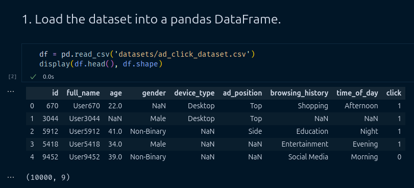
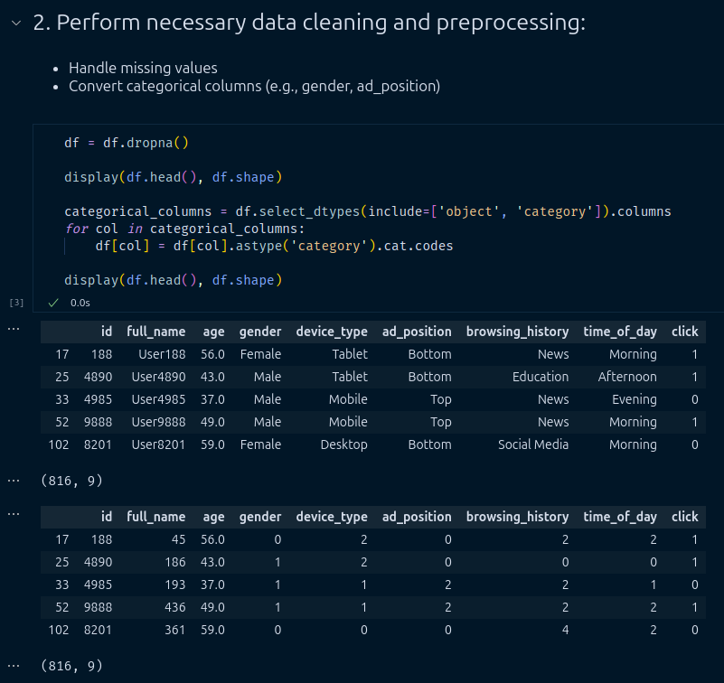
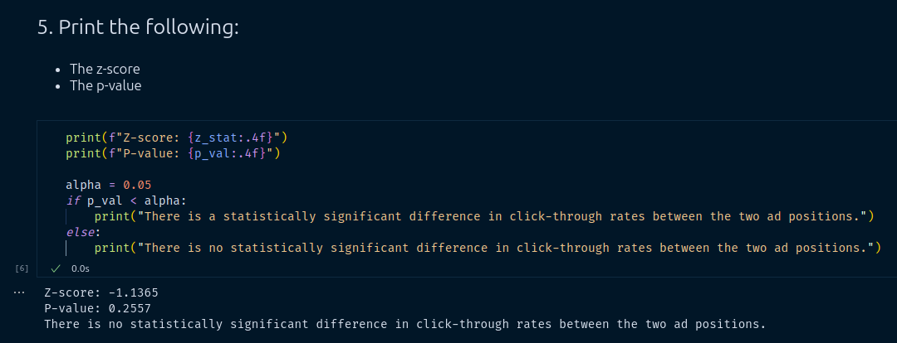
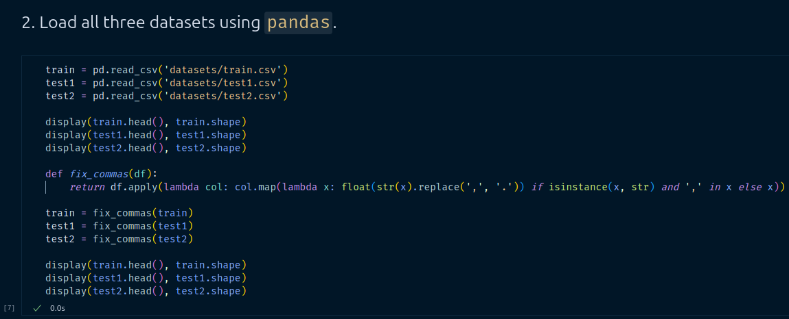
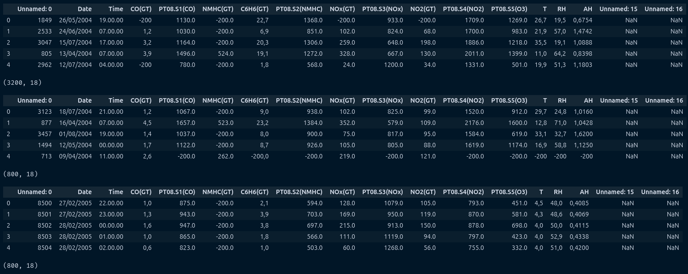
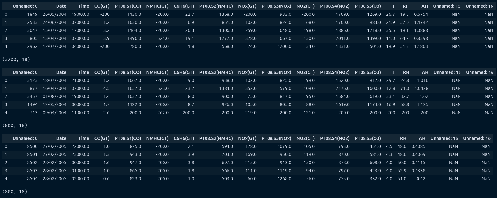
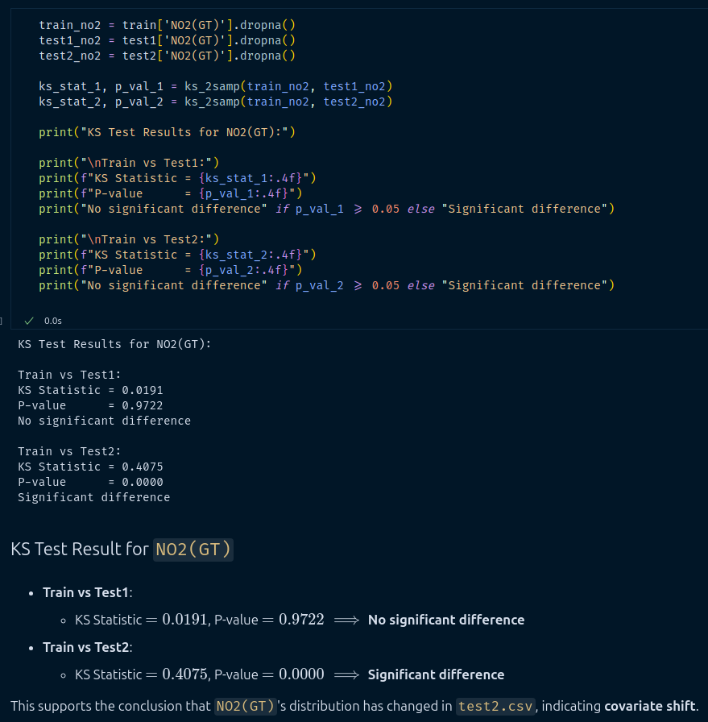

# **CS203: Software Tools & Techniques for AI**  
**Lab Assignment 10: A/B Testing & Covariate Shift Detection**  
**IIT Gandhinagar | Sem II – 2024-25**

---

## **Team Members (Team 17)**
- **Nishchay Bhutoria** (23110222)  
- **Srivaths P** (23110321)

---

## **Objective**
This assignment explores the concepts of:
- A/B Testing using **proportions Z-test**
- Covariate shift detection using the **Kolmogorov–Smirnov (KS) test**

We use real-world datasets (Ad Clicks and Air Quality) and implement the analysis in Python using `pandas`, `scipy`, and `statsmodels`.

---

# **Part 1: A/B Testing using Ad Click Prediction**

### **1. Dataset Loading & Preprocessing**
- Dataset: `ad_click_dataset.csv`
- **Dropped missing values**
- **Encoded categorical features** using `cat.codes`

---

### **2. Group Definition**
- **Group A**: Users with `ad_position = 2` (**Top**)  
- **Group B**: Users with `ad_position = 0` (**Bottom**)

---

### **3. Z-Test**
- Test: `proportions_ztest()`
- Metrics:
  - **Z-score**: `-1.1365`
  - **P-value**: `0.2557`

---

### **4. Interpretation**

We performed a two-sample z-test to compare CTR between two positions:

**Hypotheses:**
- $H_0$: No difference in CTR between top and bottom positions.
- $H_1$: There is a difference.

Since `p = 0.2557 > 0.05`, we **fail to reject H₀**.

✅ **Conclusion:**  
There is **no statistically significant difference** in CTR between top and bottom ad placements. Ad position may **not significantly affect** engagement.

---

# **Part 2: Covariate Shift Detection (Air Quality Data)**

### **1. Dataset Preparation**
- Datasets: `train.csv`, `test1.csv`, `test2.csv`
- Decimal commas converted to floats

---

### **2. KS Test on `NO2(GT)`**

| Comparison         | KS Statistic | P-value | Result                  |
|--------------------|--------------|---------|--------------------------|
| Train vs Test1     | 0.0191       | 0.9722  | No significant difference |
| Train vs Test2     | 0.4075       | 0.0000  | **Significant difference** |

✅ **Conclusion:**  
`test2.csv` shows a **clear shift** in the distribution of `NO2(GT)`.

---

### **3. KS Test for All Features**

| **Feature**       | **KS Statistic (test1)** | **P-value (test1)** | **KS Statistic (test2)** | **P-value (test2)** |
|-------------------|--------------------------|----------------------|---------------------------|----------------------|
| PT08.S1(CO)       | 0.032813                 | 0.490012             | 0.127500                  | 1.65e-09             |
| NMHC(GT)          | 0.012812                 | 0.999921             | 0.227187                  | 1.98e-29             |
| C6H6(GT)          | 0.020938                 | 0.938445             | 0.142500                  | 8.89e-12             |
| PT08.S2(NMHC)     | 0.021562                 | 0.923540             | 0.141875                  | 1.12e-11             |
| NOx(GT)           | 0.017500                 | 0.988482             | 0.524062                  | 4.13e-162            |
| PT08.S3(NOx)      | 0.034375                 | 0.430351             | 0.322813                  | 1.43e-59             |
| NO2(GT)           | 0.019062                 | 0.972194             | 0.407500                  | 7.20e-96             |
| PT08.S4(NO2)      | 0.020000                 | 0.957373             | 0.597187                  | 1.35e-214            |
| PT08.S5(O3)       | 0.028125                 | 0.685568             | 0.136563                  | 7.54e-11             |

**Features with significant shifts in `test2.csv`** (p-value < 0.05):

- `PT08.S1(CO)`  
- `NMHC(GT)`  
- `C6H6(GT)`  
- `PT08.S2(NMHC)`  
- `NOx(GT)`  
- `PT08.S3(NOx)`  
- `NO2(GT)`  
- `PT08.S4(NO2)`  
- `PT08.S5(O3)`  

**All 9 numeric features** show significant distributional differences between `test2.csv` and `train.csv`, indicating **strong evidence of covariate shift**.

**Features in `test1.csv`** show **no significant shift** (all p-values > 0.05)

---

### **4. Final Conclusion**

Using the KS test, we compared each test dataset to the training distribution.

- **`test1.csv`**: No covariate shift
- **`test2.csv`**: Covariate shift detected (multiple features)
